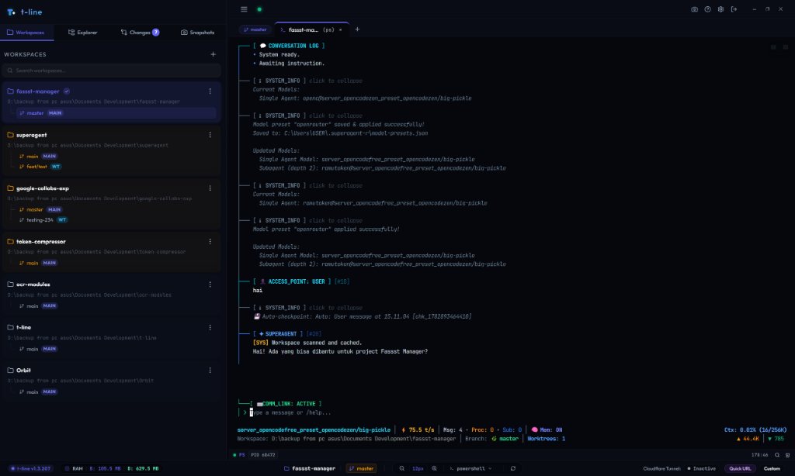

# t-line — Premium Workspace Manager & Git Worktree Orchestrator `v1.3.76`

[](LICENSE)

> A high-performance, developer-first workspace dashboard. Run GPU-accelerated multi-shell PTY terminals, visualize and manage Git Worktrees, browse and edit code, and securely share your workspace remotely via Cloudflare Tunnel. All inside a sleek Obsidian Dark interface.



---

## ⚡ The Developer's Context-Switching Solution

Modern software engineering requires juggling multiple branches, repositories, and terminals. **t-line** solves the cognitive load of context-switching by combining Git Worktree automation, terminal multiplexing, and remote workspace sharing into a unified, lightweight, local-first application. 

### Why use t-line?
* **Adopt Git Worktrees without CLI friction**: Work on multiple features concurrently in isolated directories without stashing or breaking your flow.
* **Instant, Secure Remote Access**: Share your local environment with clients or team members in one click via built-in Cloudflare Tunnel support.
* **Ultra-Fast Terminals**: Custom GPU-accelerated xterm.js terminals reduce lag and render smooth graphics.
* **Beautiful Obsidian Dark Aesthetic**: Optimized for long coding sessions with an elegant, frameless UI.

---

## 🚀 Key Features & Value Proposition

### 🖥️ GPU-Accelerated Multi-Shell PTY Terminal
* **Concurrent Terminals**: Spawn and manage multiple sessions across PowerShell, CMD, Git Bash, or WSL.
* **GPU Canvas Renderer**: Built-in `@xterm/addon-canvas` rendering delivers lightning-fast scrolling and reduces CPU utilization.
* **Dynamic Process Polling**: Automatically polls background process names to update tab titles dynamically, solving native WinPTY title resolution limits on Windows.
* **Interactive Tooling & Images**: Support for `@xterm/addon-image` allows terminal previews and inline image rendering via sixel/iTerm2.
* **Developer Safety Filters**: Smart paste warnings prevent accidental multi-line executions in active shells.
* **Focus Ring Highlight**: Visually track active panes with a soft glowing purple focus ring.

### 🌿 Visual Git Worktrees Management
* **Real-time Dirty Indexing**: Instantly flags modified or untracked files with glowing amber indicators and uncommitted change badges.
* **Dirty-First Auto-Sorting**: Workspaces with active modifications are automatically floated to the top of the sidebar.
* **Safety Lock Pruning**: Automatically shuts down terminal tabs and file locks associated with a worktree before removal. Falls back to direct file-system removal and manual registry pruning if files are locked.

### 📁 Unified Workspace Explorer & Editor
* **Full-Bleed UI**: Clean borderless sidebar layout maximizing screen real estate.
* **Built-in Monaco Editor**: View and modify codebase files directly in editor tabs alongside terminal panes, complete with copy shortcuts and clean formatting.
* **Auto-Focus Selection**: Automatically selects the first active or Git-enabled workspace on switch.

### 🌐 Secure Cloudflare Tunneling & ACL
* **One-Click Share**: Instantly expose the dashboard using Quick URL or a Custom Tunnel token.
* **Access Control List (ACL)**: Detailed connection loggers let you monitor incoming requests, block specific IPs, or restrict WebSocket terminal access with built-in lockout protection.

### 🪟 Native Electron Desktop Integration
* **Frameless App**: Draggable borderless UI that launches maximized with custom system control actions.
* **Tray Minimization**: Minimize to taskbar/system tray on window close, with tray context menu backend lifecycle control.
* **Single Instance Safety**: Detects active backend instances on port `3999` to prevent port binding conflicts.

---

## 🛠️ Technology Stack

| Layer | Technologies Used |
| :--- | :--- |
| **Frontend** | React (TS), Vite, Tailwind CSS v4, Monaco Editor, xterm.js + Canvas / WebLinks / Image addons |
| **Backend** | Node.js, Express, WebSocket (`ws`), `node-pty`, `bcryptjs` |
| **Desktop** | Electron, Electron-Builder (Installer/Portable EXE) |

---

## 🏃 Quick Start

### Prerequisites
* [Node.js](https://nodejs.org/) (LTS recommended)
* Git configured in your system PATH
* Windows 10/11 (Primary target OS)

### 1. Install Project Dependencies
Run from the root directory:
```powershell
npm install
```

### 2. Run in Development Mode
Launches the Express backend (`3999`) and Vite frontend (`5173`) concurrently with hot reloading:
```powershell
npm run dev
```

### 3. Launch Electron Desktop Client
Runs the full Electron application, bypassing backend spawn if port `3999` is already in use:
```powershell
npm run desktop
```

### 4. Build Standalone Installer (`.exe`)
Compiles frontend assets, transpiles TypeScript, and packages the app using `electron-builder` inside `desktop/dist-exe/`:
```powershell
npm run build:exe
```

---

## 📂 Architecture Directory

```
t-line/
├── backend/          # Express + WebSockets + node-pty server (Port 3999)
├── frontend/         # React + Vite SPA (Vite + Tailwind CSS v4)
│   └── src/
│       ├── hooks/    # Custom React hooks (useTerminals, useTunnel, useWorkspaces)
│       └── components/
├── desktop/          # Electron wrapper, IPC bridge, Tray, & build configs
├── preview.png       # Desktop application preview image
└── package.json      # Root monorepo workspace configuration
```

> [!IMPORTANT]
> **Code Quality Constraint**: To maintain high maintainability, no source code file in this repository is allowed to exceed **1,000 lines**. Oversized files are refactored into modular hooks or sub-components.

---

## 📄 License & Attribution

Distributed under the MIT License. See [LICENSE](LICENSE) for details.

Copyright © 2026 [Rudy H.](mailto:hrudy715@gmail.com)
