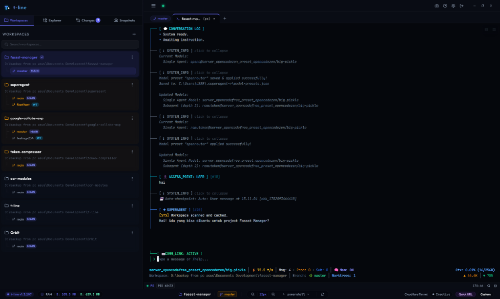

# t-line — Developer Workspace & SuperAgent AI Orchestrator

[](LICENSE)
[](https://tauri.app)
[](https://bun.sh)
[](https://react.dev)
[](https://www.typescriptlang.org)

> **t-line** is a high-performance developer workspace manager, GPU-accelerated terminal dashboard, Git worktree orchestrator, and **SuperAgent AI Integration Platform**. Built with Tauri v2, Bun, Express, and React, t-line seamlessly bridges deep terminal execution with multi-agent AI workflows.



---

## ✨ Key Features

### 🤖 SuperAgent AI Orchestration
* **Full HTTP & WebSocket Proxy Bridge**: Seamlessly connects to SuperAgent's port 7888 REST & SSE APIs (45+ endpoints).
* **Multi-Agent Tree Visualizer**: Real-time interactive visualization of subagents, superagent instances, process states, and execution DAGs.
* **100% Server-Proxy Configuration**: Centralized management of provider models, API profiles, system prompts, presets, and MCP servers without direct file mutation.
* **RMemory & Context Inspector**: Live browsing of short-term (L0), long-term (L1), and scene block (L2) AI agent memory.
* **Interactive Tool Approvals**: Real-time permission handling, question-answering prompts, and plan approval gates embedded into the streaming chat UI.

### 🖥️ High-Performance GPU Terminal
* **xterm.js Engine**: Canvas & WebGL GPU rendering with WebSockets PTY support.
* **Flexible Grid Layouts**: Split screen vertical/horizontal grids, tabbed terminals, and floating subagent console windows.
* **Cross-Platform PTY**: Built-in support for PowerShell, Git Bash, zsh, bash, and custom developer environments.

### 🌿 Git Worktree & Repository Orchestrator
* **Parallel Worktree Management**: Create, list, switch, prune, and delete Git worktrees without context switching.
* **Visual Diff & File Inspector**: Side-by-side git diff viewer, visual branch history graphs, stage/unstage controls, and fast commit actions.
* **Workspace Checkpoints**: Instant workspace state save & restoration via lightweight git stash integration.

### 🌐 Embedded Browser & DevTools
* **Autonomous Web Scraping & Control**: Integrated Chrome extension listener, Network XHR logger, Console log inspector, and HTML/Markdown page extractor.
* **Tab & Viewport Emulation**: Test mobile/tablet/desktop viewports and inspect storage/cookies directly from the t-line sidebar.

### 🔐 Security & Remote Workspace Sharing
* **Cloudflare Tunnel Integration**: Share your local dev server, terminal sessions, and workspace remotely with zero-trust access tokens and password protection.
* **Tauri v2 Desktop Native**: Native C++/Rust desktop wrapper keeping RAM footprint under 100MB with system tray support.

---

## 🏗️ Architecture Overview

```text
┌─────────────────────────────────────────────────────────┐
│                    t-line Desktop                       │
│        (Tauri v2 Native Wrapper / Web UI)               │
└───────────────────────────┬─────────────────────────────┘
                            │ WebSocket / REST API
                            ▼
┌─────────────────────────────────────────────────────────┐
│                    t-line Backend                       │
│                (Express.js + Bun Runtime)               │
├───────────────────────────┬─────────────────────────────┤
│ • Terminal Manager (PTY)  │ • superAgentBridge.ts       │
│ • Git Worktree Manager    │ • superAgentRoutes.ts       │
│ • Cloudflare Tunnel Proxy │ • File Explorer & Checkpoint│
└───────────────────────────┴──────────────┬──────────────┘
                                           │ HTTP/SSE (port 7888)
                                           ▼
                            ┌─────────────────────────────┐
                            │    SuperAgent Engine        │
                            │  (AI Agent & Subagent Core) │
                            └─────────────────────────────┘
```

---

## 🚀 Quick Start

### Prerequisites
* [Bun](https://bun.sh) `1.1+` (or Node.js `20+`)
* [Rust](https://www.rust-lang.org/) (required only for building Tauri v2 desktop binaries)
* [Git](https://git-scm.com/)

### Installation & Development Run

1. **Clone the Repository**
   ```bash
   git clone https://github.com/your-username/t-line.git
   cd t-line
   ```

2. **Install Dependencies**
   ```bash
   bun install
   ```

3. **Start Development Environment**
   ```bash
   bun dev
   ```
   *Starts backend Express server, Vite React frontend, and auto-connects to SuperAgent bridge.*

4. **Launch Desktop App (Optional)**
   ```bash
   bun run tauri dev
   ```

---

## 📁 Repository Structure

```text
t-line/
├── backend/                  # Express.js backend server
│   ├── src/
│   │   ├── server.ts          # Backend entrypoint & API router
│   │   ├── superAgentBridge.ts# SuperAgent lifecycle & SSE bridge
│   │   ├── superAgentRoutes.ts# 100% REST proxy for SuperAgent port 7888
│   │   ├── terminalManager.ts # xterm.js PTY process manager
│   │   ├── gitManager.ts      # Git worktree & branch operations
│   │   └── tunnelManager.ts   # Cloudflare Tunnel integration
├── frontend/                 # React 18 + Vite frontend UI
│   ├── src/
│   │   ├── components/        # UI components (SuperAgent Console, Worktrees, Terminal Grid)
│   │   ├── hooks/             # Custom React hooks (terminals, git, web sockets)
│   │   └── services/          # WebSocket & HTTP API client modules
├── src-tauri/                # Tauri v2 Rust desktop configuration
├── CHANGELOG.md              # Project version & release history
└── package.json              # Project workspace dependencies & scripts
```

---

## 📝 Configuration & Integration Rules

* **Single Source of Truth**: All SuperAgent configurations, presets, memory, and model profiles are proxied via `superAgentRoutes.ts` to port 7888. The t-line backend never mutates user config files directly.
* **Strict Code Quality**: Maximum file length limit is set to 1000 LOC per module to enforce modular architecture and maintainability.

---

## 🤝 Contributing

Contributions are welcome! Please make sure to test your code and follow the guidelines specified in `AGENTS.md`.

1. Fork the repo
2. Create a feature branch (`git checkout -b feature/amazing-feature`)
3. Commit your changes (`git commit -m 'Add amazing feature'`)
4. Push to the branch (`git checkout -b feature/amazing-feature`)
5. Open a Pull Request

---

## 📄 License

This project is licensed under the [MIT License](LICENSE).
